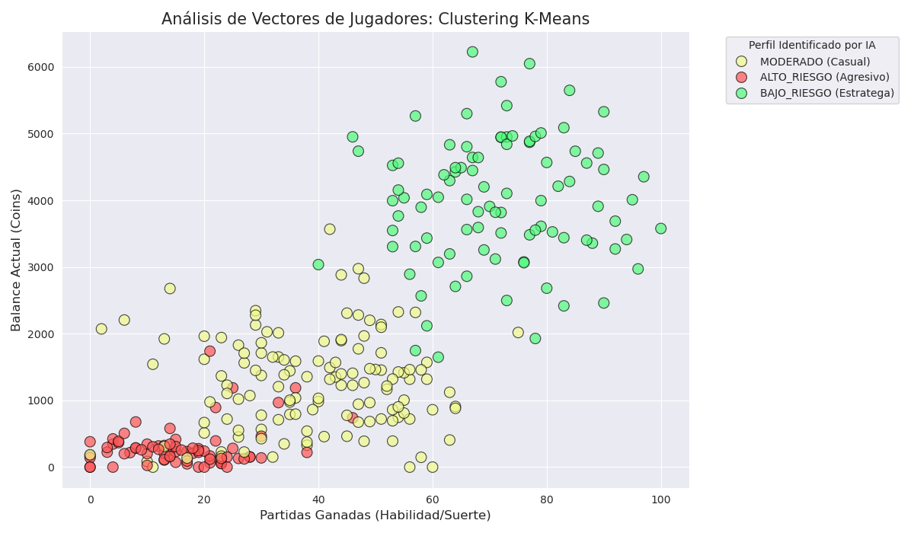
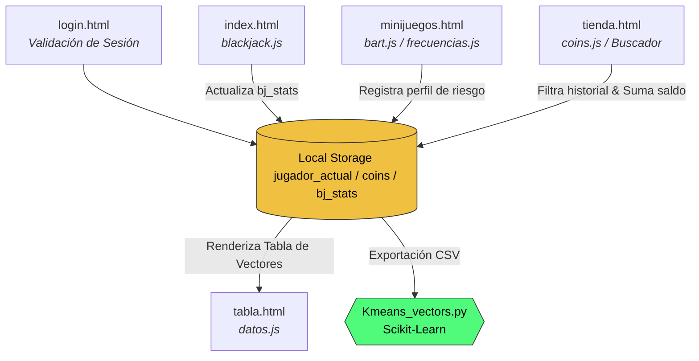

# Sistema de Evaluación Conductual y Análisis de Riesgo

## Referencias
* [Enlace](https://danzanfer.github.io/ProyectoPersonal/login.html)

Este proyecto es una plataforma web experimental que combina mecánicas de juego clásicas con herramientas de psicología conductual y aprendizaje no supervisado. El sistema recolecta métricas de interacción del usuario para clasificar perfiles de riesgo mediante algoritmos de clustering.




## Tecnologías Utilizadas

  * **Frontend:** HTML5, CSS3 (Variables, Flexbox, Grid), JavaScript.
  * **Persistencia:** LocalStorage para gestión de sesiones y vectores.
  * **IA/Análisis:** Python, Scikit-Learn (K-Means), Pandas, Matplotlib/Seaborn.
  * **APIs:** Fetch API para consumo de datos climáticos.

-----

## Capas del Ecosistema

### Interfaz y Experiencia de Usuario (Frontend)

  * **Gestión de Sesión:** Implementada en `login.html` con un sistema de persistencia en `localStorage`.
  * **Mesa de Juego:** Un simulador de Blackjack completo (`blackjack.js`) que registra victorias, derrotas y gestión de capital.
  * **Mini-juegos de Diagnóstico:** \* **BART (Balloon Analogue Risk Task):** Un estándar en psicología para medir la toma de decisiones bajo incertidumbre.
      * **Test de Frecuencias:** Un barrido auditivo para estimar la edad biológica auditiva del usuario.
  * **Estilos:** Sistema modular de CSS con una estética oscura y técnica.
  

### Recolección de Datos (Vectores)

El sistema transforma el comportamiento del usuario en un **Vector Conductual** visible en `tabla.html`. Cada registro incluye:

  * `bj_ganadas` / `bj_perdidas`: Rendimiento en el simulador de cartas.
  * `coins_actuales`: Capacidad de ahorro y gestión de recursos.
  * `bart_neto`: Resultado económico en pruebas de riesgo extremo.
  * `bart_perfil`: Etiqueta generada por la lógica de negocio basada en el score ajustado de bombeo.
  
## Estructura del Proyecto

```text
.
├── css/
│   ├── blackjack.css      # Estilos de la mesa de juego
│   ├── minijuegos.css     # Estilos de BART y Tienda
│   └── shared.css         # Variables de diseño (Dark Mode)
├── js/
│   ├── bart.js            # Lógica de toma de riesgo (Balloon Task)
│   ├── blackjack.js       # Simulador de cartas y apuestas
│   ├── coins.js           # Sistema global de economía
│   ├── datos.js           # Módulo de captura conductual
│   ├── errores.js         # Clases POO y manejo de excepciones
│   ├── frecuencias.js     # Test de barrido auditivo
│   └── weather.js         # Integración con API de Clima
├── clustering_results.png # Visualización del modelo IA
├── index.html             # Dashboard principal (Blackjack)
├── Kmeans_vectors.py      # Script de Clustering (K-Means)
├── login.html             # Control de acceso y persistencia
├── minijuegos.html        # Hub de diagnósticos
├── tabla.html             # Visualización de vectores generados
└── tienda.html            # Sistema de filtrado y transacciones
```

### Análisis de Inteligencia Artificial (Backend/Data Science)

El archivo `Kmeans_vectors.py` procesa la información recolectada utilizando la librería **Scikit-Learn**:

  * **Preprocesamiento:** Uso de `StandardScaler` para normalizar las métricas de juego.
  * **Clustering:** Implementación del algoritmo **K-Means** para agrupar a los usuarios en tres clústeres (Estratega, Casual y Agresivo).
  
  
## Arquitectura y Flujo de Datos

<center>



</center>

## Requisitos Técnicos

  * **Web:** Navegador moderno con soporte para ES6+.
  * **Análisis de Datos:** Python con `pandas`, `numpy`, `scikit-learn`, `matplotlib` y `seaborn`.

## Instalación y Uso

1.  **Entorno Web:** Abrir `index.html` en el navegador.
2.  **Generación de Datos:** Jugar para acumular estadísticas en la sección de "Vectores".
3.  **Análisis:** Ejecutar el script de Python para visualizar la segmentación de clústeres.

## Notas de Desarrollo

El proyecto utiliza un sistema de manejo de errores personalizado (`errores.js`) basado en **POO** que categoriza fallos de validación, almacenamiento y autenticación.
